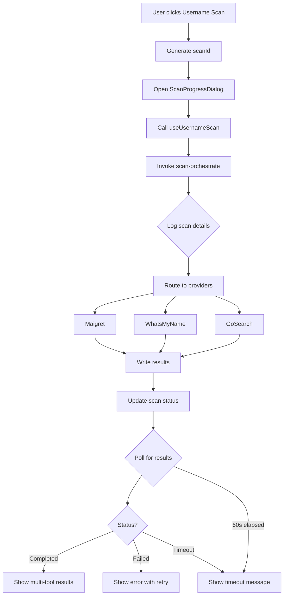

# Multi-Tool Username Scan Implementation

## Summary

Successfully implemented end-to-end multi-tool username scanning with proper progress tracking, timeout handling, and multi-provider result display.

## Changes Made

### 1. Enhanced Logging (`supabase/functions/scan-orchestrate/index.ts`)
**Lines Modified: 120-129**
- Added detailed logging for username scans
- Logs include: scanId, providers array, and scan options
- Example log output:
  ```
  [orchestrate] Scanning username:johndoe for workspace abc-123 {
    scanId: "xyz-789",
    providers: ["maigret", "whatsmyname", "gosearch"],
    includeDarkweb: false
  }
  ```

### 2. Fixed "Loading Forever" Issue (`src/components/maigret/SimpleResultsViewer.tsx`)
**Lines Modified: 25-60, 82-169, 185-197**

#### Added State Management:
- `pollCount`: Tracks number of polling attempts
- `timedOut`: Flags when scan exceeds 60-second timeout

#### Polling Logic:
- Polls every 3 seconds
- Stops after 20 attempts (60 seconds total)
- Stops immediately on completed/failed status

#### Error States:
1. **Timeout State** (lines 96-120):
   - Shows after 60 seconds with no results
   - Provides "Check Again" and "Back to Scanner" buttons
   - Explains possible causes (still processing, high load, no matches)

2. **Failed Scan State** (lines 134-169):
   - Displays backend error message
   - Shows username and job ID
   - Provides "Try Again" and "Refresh" buttons

3. **Network Error State** (lines 82-95):
   - Shows error message
   - Provides "Retry" button

### 3. Multi-Tool Results Display (`src/components/maigret/SimpleResultsViewer.tsx`)
**Lines Modified: 281-296, 298-312**

#### Provider Detection:
```typescript
const provider = item.provider || 'maigret'; // Default for legacy results
```

#### Color-Coded Provider Badges:
- **Maigret**: `bg-blue-100 text-blue-700` (blue)
- **WhatsMyName**: `bg-purple-100 text-purple-700` (purple)
- **GoSearch**: `bg-green-100 text-green-700` (green)

#### Display:
Each result now shows:
- Platform name
- Provider badge (colored)
- URL (clickable)
- Status information

### 4. Previously Implemented (Phase 2 & 3)

#### `useUsernameScan.ts` (lines 62-64, 13-20):
- Accepts optional `scanId` parameter
- Calls `scan-orchestrate` instead of `scan-start`
- Passes providers array: `['maigret', 'whatsmyname', 'gosearch']`

#### `AdvancedScan.tsx` (lines 605-624):
- Generates scanId with `crypto.randomUUID()`
- Opens progress dialog BEFORE starting scan
- Tracks scan progress in real-time
- Navigates to results on completion

#### Branding Updates:
- Removed "Maigret" from all username scan UI
- Updated to "Username OSINT scan" / "Username Scan Results"
- Kept `/maigret/results/:jobId` route for backwards compatibility

## Complete Flow



## Testing Checklist

✅ **Scan Initiation**:
- Progress dialog appears immediately
- No navigation until scan completes

✅ **Backend Logging**:
- Logs show scanId, username, providers array
- Logs include scan options

✅ **Timeout Handling**:
- Results page stops polling after 60 seconds
- Shows clear timeout message
- Provides "Check Again" button

✅ **Error Handling**:
- Failed scans show backend error message
- "Try Again" button navigates back to scanner
- No infinite loading spinners

✅ **Multi-Tool Display**:
- Results show provider badges (blue/purple/green)
- Legacy results default to "maigret" badge
- All findings are clickable

✅ **Branding**:
- No "Maigret only" references in username scan UI
- Page titles say "Username Scan Results"
- Route `/maigret/results/:jobId` still works

## Files Modified

1. `supabase/functions/scan-orchestrate/index.ts` - Enhanced logging
2. `src/components/maigret/SimpleResultsViewer.tsx` - Timeout handling + multi-tool display
3. `src/hooks/useUsernameScan.ts` - Previously updated (scan-orchestrate integration)
4. `src/pages/AdvancedScan.tsx` - Previously updated (progress dialog integration)

## Expected Behavior

### Successful Scan:
1. Progress dialog shows for ~15-30 seconds
2. Dialog closes and navigates to results
3. Results show findings grouped by provider
4. Each finding has colored badge (Maigret/WhatsMyName/GoSearch)

### Failed Scan:
1. Progress dialog shows error
2. OR results page shows error panel
3. Error message includes backend details
4. "Try Again" button available

### Timeout:
1. After 60 seconds, polling stops
2. Shows "Scan Timeout" message
3. Suggests possible causes
4. "Check Again" button available

## Next Steps (Optional Enhancements)

1. **Provider Filtering**: Add UI to filter results by provider
2. **Provider Stats**: Show counts per provider (e.g., "Maigret: 45, WhatsMyName: 23")
3. **Retry Failed Providers**: Allow re-running only failed providers
4. **Export by Provider**: Export results filtered by specific tool
